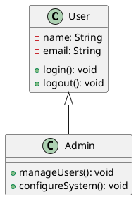
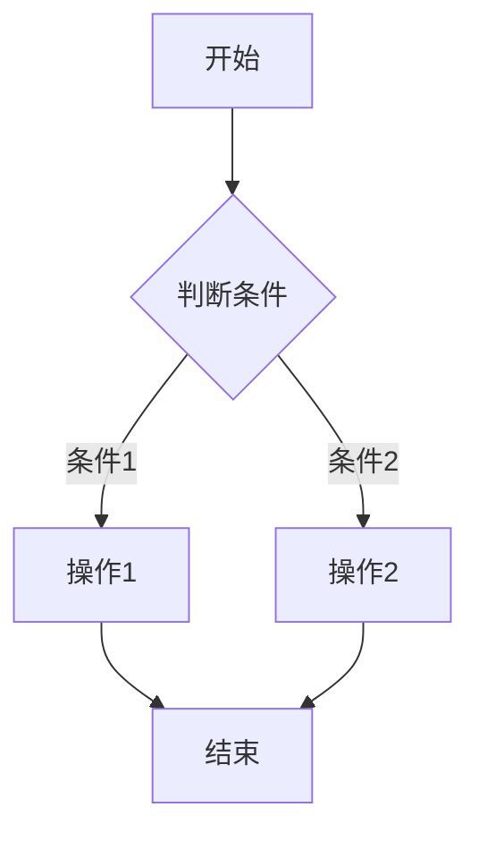

# Wiki.js 编辑器和内容格式详解

## 概述

Wiki.js 提供多种编辑器选项，支持不同的内容格式和工作流程。每种编辑器都有其特定的用途和优势。

## 可用编辑器类型

### 1. Markdown 编辑器

#### 特性
- **标准 Markdown 支持**: 完整兼容 CommonMark 规范
- **GitHub Flavored Markdown (GFM)**: 扩展语法支持
- **实时预览**: 所见即所得的预览模式
- **语法高亮**: 代码块自动语法高亮
- **快捷键支持**: 提高编辑效率的快捷键

#### 基本语法
```markdown
# 标题 1
## 标题 2
### 标题 3

**粗体文本**
*斜体文本*
~~删除线~~

- 无序列表项
- 另一个列表项

1. 有序列表项
2. 另一个有序项

[链接文本](https://example.com)


`内联代码`

```
代码块
```

> 引用文本

---

水平分隔线
```

#### GFM 扩展语法
```markdown
## 表格

| 列 1 | 列 2 | 列 3 |
|------|------|------|
| 数据1 | 数据2 | 数据3 |
| 数据4 | 数据5 | 数据6 |

## 任务列表

- [x] 已完成任务
- [ ] 未完成任务

## 自动链接
https://github.com/Requarks/wiki

## 删除线
~~这是删除线文本~~
```

#### 代码块语法高亮
````markdown
```javascript
function hello() {
  console.log('Hello, World!');
}
```

```python
def hello():
    print('Hello, World!')
```

```bash
echo "Hello, World!"
```
````

### 2. Code (MDX) 编辑器

#### 特性
- **MDX 支持**: Markdown + JSX 组件
- **动态内容**: 可执行 JavaScript 代码
- **组件复用**: 创建可重用的 UI 组件
- **数据绑定**: 动态数据渲染
- **交互式元素**: 添加交互功能

#### 基本语法
```markdown
import { Chart } from './components/chart'
import { Button } from './components/ui'

# 数据分析报告

<Chart type="bar" data={salesData} />

<Button onClick={handleClick}>点击我</Button>

## 详细说明

这里是标准的 Markdown 内容，可以与组件混合使用。
```

#### 组件开发
```javascript
// components/custom-widget.js
export default function CustomWidget({ title, data }) {
  return (
    <div className="widget">
      <h3>{title}</h3>
      <ul>
        {data.map(item => (
          <li key={item.id}>{item.name}</li>
        ))}
      </ul>
    </div>
  );
}

// 在页面中使用
import CustomWidget from './components/custom-widget'

<CustomWidget
  title="销售数据"
  data={salesData}
/>
```

### 3. Visual Editor (WYSIWYG)

#### 特性
- **所见即所得**: 实时预览编辑效果
- **富文本格式**: 支持多种文本格式
- **拖放操作**: 直观的内容组织
- **格式工具栏**: 丰富的格式化选项
- **表格编辑器**: 可视化表格编辑
- **图片处理**: 直接插入和编辑图片

#### 支持的格式
- **文本格式**: 粗体、斜体、下划线、删除线
- **标题级别**: H1-H6
- **列表**: 有序和无序列表
- **对齐方式**: 左对齐、居中、右对齐
- **颜色**: 文本颜色和背景色
- **字体**: 多种字体选项
- **链接**: 内部和外部链接
- **媒体**: 图片、视频嵌入

### 4. AsciiDoc 编辑器

#### 特性
- **技术文档**: 适合编写技术文档
- **结构化内容**: 支持复杂文档结构
- **包含指令**: 模块化文档组织
- **属性替换**: 动态内容生成
- **表格支持**: 高级表格功能

#### 基本语法
```asciidoc
= 文档标题
作者姓名

== 第一章节

这里是段落内容。

* 无序列表项
* 另一个列表项

. 有序列表项
. 另一个有序项

[source,python]
----
def hello():
    print('Hello')
----

----
引用块
----

链接: https://example.com[链接文本]

image::image.jpg[图片描述]
```

### 5. PlantUML 编辑器

#### 特性
- **UML 图表**: 统一建模语言图表
- **多种图表类型**: 类图、序列图、用例图等
- **自动布局**: 智能图表布局
- **导出功能**: 多种格式导出

#### 示例语法


### 6. Mermaid 编辑器

#### 特性
- **流程图**: 业务流程可视化
- **序列图**: 系统交互展示
- **甘特图**: 项目时间线
- **类图**: 类关系图
- **状态图**: 状态转换图

#### 示例语法


## 编辑器配置

### 默认编辑器设置
```yaml
# config.yml
editor:
  default: markdown
  allowSwitch: true
```

### 编辑器特定配置
```yaml
# Markdown 编辑器配置
markdown:
  lineNumbers: true
  spellCheck: true
  theme: default

# Code 编辑器配置
code:
  lineNumbers: true
  syntaxHighlighting: true
  autoComplete: true
  theme: monokai
```

## 内容格式最佳实践

### 1. Markdown 最佳实践

#### 文档结构
```markdown
# 页面标题

简短的页面描述。

## 目录
- [第一节](#第一节)
- [第二节](#第二节)

## 第一节
主要内容...

## 第二节
更多内容...

## 相关页面
- [相关页面1](/path/to/page1)
- [相关页面2](/path/to/page2)
```

#### 链接管理
```markdown
# 内部链接
[页面标题](/path/to/page)
[[页面标题]]  # 简写语法

# 外部链接
[GitHub](https://github.com)

# 锚点链接
[跳转到标题](#标题)
```

#### 图片处理
```markdown
# 基本图片


# 带尺寸的图片


# 带标题的图片


# 响应式图片
<figure>
  
  <figcaption>图片说明</figcaption>
</figure>
```

### 2. Code 编辑器最佳实践

#### 组件组织
```javascript
// 组件文件结构
components/
├── charts/
│   ├── BarChart.js
│   └── LineChart.js
├── ui/
│   ├── Button.js
│   └── Card.js
└── data/
    └── DataLoader.js
```

#### 数据管理
```markdown
import { useData } from './hooks/useData'

# 数据报告

const data = useData('sales-data')

<Chart data={data} />
```

### 3. Visual 编辑器最佳实践

#### 样式一致性
- 使用预定义的样式
- 保持标题层级清晰
- 合理使用列表和表格
- 注意空白和间距

#### 内容组织
- 使用标题分隔内容块
- 合理使用加粗和强调
- 保持段落简洁
- 适当使用多媒体元素

## 高级功能

### 1. 宏系统

#### 内置宏
```markdown
# 目录生成
>>toc

# 视频嵌入
>>video(path: 'presentation.mp4', poster: 'preview.jpg')

# 图表插入
>>chart(type: 'line', data: '{...}')

# 代码高亮
>>code(lang: 'javascript')
function example() {
  console.log('Hello');
}
<<
```

#### 自定义宏
```javascript
// 自定义宏定义
module.exports = {
  container({ body }) {
    return `<div class="custom-container">${body}</div>`;
  }
};
```

### 2. 模板系统

#### 页面模板
```yaml
# config.yml
templating:
  enabled: true
  engines:
    - nunjucks
    - handlebars
```

#### 模板语法
```markdown
# 使用模板变量
{{pageTitle}}

# 条件渲染

  欢迎回来，{{user.name}}！

  请先登录。

```

### 3. 国际化支持

#### 多语言内容
```markdown
# en.md
# Welcome
This is the English version.

# zh.md
# 欢迎
这是中文版本。
```

#### 语言切换
```markdown
[English](/en/page)
[中文](/zh/page)
```

## 迁移指南

### 从其他编辑器迁移

#### 从 HTML 到 Markdown
```html
<!-- HTML -->
<h1>标题</h1>
<p><strong>粗体</strong> 和 <em>斜体</em></p>
<ul>
  <li>列表项</li>
</ul>
```

```markdown
<!-- Markdown -->
# 标题

**粗体** 和 *斜体*

- 列表项
```

#### 从 Word 到 Wiki.js
1. 复制 Word 内容
2. 粘贴到 Visual Editor
3. 格式清理和调整
4. 保存并验证

## 性能优化

### 大型文档处理
- 分割大型文档为多个页面
- 使用包含指令组织内容
- 实施懒加载策略
- 优化图片和媒体文件

### 缓存策略
```yaml
# 编辑器缓存配置
caching:
  pageCache: true
  fragmentCache: true
  versionedCache: true
```

## 常见问题解决

### 格式问题
- **Markdown 不渲染**: 检查语法正确性
- **代码高亮失效**: 确认语言标识符
- **图片不显示**: 验证路径和权限

### 编辑器问题
- **编辑器无响应**: 清除浏览器缓存
- **快捷键不工作**: 检查浏览器快捷键冲突
- **自动保存失败**: 验证网络连接和权限

## 选择合适的编辑器

### 使用场景指南

#### Markdown 编辑器
- **技术文档**: API 文档、开发指南
- **个人笔记**: 快速记录和组织信息
- **协作编辑**: 团队知识库
- **版本控制**: Git 友好的格式

#### Code 编辑器
- **交互式文档**: 需要动态内容
- **数据可视化**: 图表和图形
- **自定义功能**: 特殊需求
- **开发文档**: 包含代码示例

#### Visual 编辑器
- **非技术用户**: 内容编辑者
- **快速创建**: 草稿和原型
- **富文本内容**: 复杂格式需求
- **营销内容**: 宣传材料

#### AsciiDoc 编辑器
- **技术规范**: 详细技术文档
- **书籍编写**: 大型文档项目
- **结构化内容**: 复杂文档结构
- **专业出版**: 高质量输出

## 编辑器扩展

### 插件系统
```javascript
// 自定义编辑器插件
const plugin = {
  name: 'custom-format',
  init(editor) {
    // 插件初始化逻辑
  },
  commands: {
    customCommand() {
      // 自定义命令实现
    }
  }
};
```

### 主题定制
```css
/* 自定义编辑器主题 */
.editor-content {
  font-family: 'Custom Font', sans-serif;
  font-size: 16px;
  line-height: 1.6;
}

.editor-content h1 {
  color: #2c3e50;
  border-bottom: 2px solid #3498db;
}
```

## 总结

Wiki.js 的多种编辑器和内容格式支持使其能够适应各种使用场景：

- **灵活性**: 根据需求选择合适的编辑器
- **兼容性**: 支持多种内容格式
- **扩展性**: 可通过插件和宏扩展功能
- **性能**: 优化的大型文档处理
- **用户体验**: 直观的编辑界面

选择合适的编辑器和遵循最佳实践将大大提高内容创建和维护的效率。
